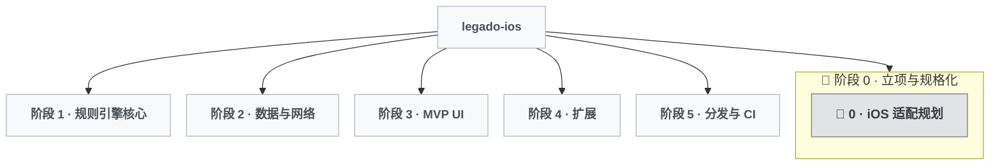

# 开发树

## 分类图例

| 图标 | 类型 | 说明 |
| - | - | - |
| 🌱 | 初建 | 某功能域首次从零建立 |
| ✨ | 功能 | 扩展用户可感知的能力 |
| 🐛 | 修复 | 纠正缺陷或回归 |
| 🏗️ | 重构 | 内部结构改善，用户行为不变 |
| 📦 | 工程 | 打包/CI/分发/工具链 |
| 🔬 | 探索 | 调研，可能被搁置 |

## 可视化

## 节点索引

> 最后更新：2026-09-12 | 共 1 轮

| # | 名称 | 类型 | 所属 Epic | 一句话描述 |
| - | - | - | - | - |
| 0 | iOS 适配规划 | 🔬 探索 | 阶段 0 · 立项与规格化 | 盘点 Android 端体量与规则引擎兼容面，对比四条路线后拍板纯 Swift 重写 + 一致性测试集，并划定阶段 0 到 5 |

## Epic 结构

（此区块由作者主导维护；AI 仅在有新开发项且作者尚未自行加入时，提议追加并等确认后写入。阶段划分与完成判据以 `docs/0-iOS适配规划/PLAN.md` §4 为准；叶 Epic 含「状态」（已完成 / 进行中 / 已放弃）与「轮次」字段，尚未开轮的阶段暂不填状态。）

### 阶段 0 · 立项与规格化

建 orphan 分支 `ios` 骨架、一致性测试语料、书源 JS 特性频率统计与宿主 API 优先级表；完成判据：语料在 Android 端一键跑出全绿基线。

- 状态：已完成（规格、142 条用例、优先级表已落地；Android 基线校正因本机无 SDK 延期，见轮次 0 SUMMARY）
- 轮次：0

### 阶段 1 · 规则引擎核心

Swift Package `LegadoCore`（无 UI）：`RuleAnalyzer`、六模式分派、jsoup 私有语法、XPath / JSONPath / 正则、`AnalyzeUrl`、JavaScriptCore 宿主分三级实现；完成判据：一致性语料通过率达阶段 0 定义的阈值。

- 状态：核心完成（8 个单元：RuleAnalyzer / UrlOptions / AnalyzeRule / SwiftSoup / JS 引擎 / JSONPath / XPath / HtmlFormatter；121 测试，一致性 142/142；真实书源回归待阶段 2 网络层）
- 轮次：0（延续）

### 阶段 2 · 数据与网络

GRDB 新 schema、Legado 备份包导入、WebDAV 客户端、URLSession 封装；完成判据：从 Android 端 WebDAV 备份恢复后书架与书源在 iOS 可用。

- 状态：核心完成（6 单元；WebDAV 只读冒烟与 1 条真实书源端到端通过；见轮次 1 SUMMARY）
- 轮次：1

### 阶段 3 · MVP UI

SwiftUI 书架 / 搜索 / 发现 / 详情 / 目录 / 阅读器（CoreText 分页）/ 书源管理 / 替换规则 / 设置 / 备份恢复；完成判据：真机走通「导入书源 → 搜索 → 加书架 → 阅读 → 进度同步」。

- 轮次：（尚未开轮）

### 阶段 4 · 扩展

每项独立立项：TTS 听书 > 本地 TXT / EPUB > `@webjs:` 与 webView 抓取 > RSS > 其余（漫画音频源、段评、字典、书源编辑器、高亮批注、局域网 Web 服务）。

- 轮次：（尚未开轮）

### 阶段 5 · 分发与 CI

GitHub Actions `xcodebuild test` 跑 `LegadoCore` 单测与一致性语料；CI 产出未签名 `.ipa`，README 给 AltStore / Sideloadly 侧载步骤。

- 轮次：（尚未开轮）
